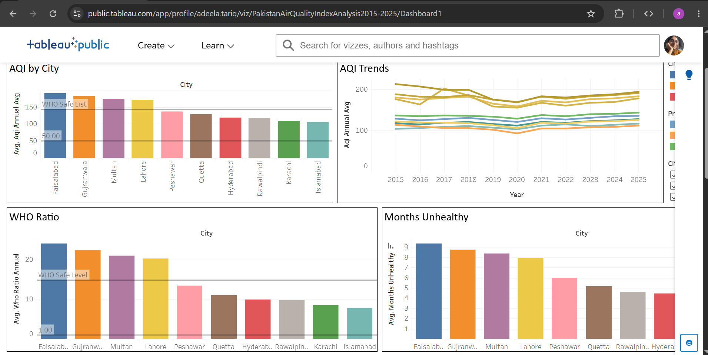

# Pakistan Air Quality Index Analysis 2015–2025

## 📊 Project Overview

This project analyzes air quality trends across selected cities in Pakistan from 2015 to 2025.

The project combines Python-based data analysis with an interactive Tableau dashboard to explore AQI patterns, compare cities, and identify trends in air quality.

## 🎯 Objectives

* Analyze air quality data from 2015 to 2025
* Compare average AQI across selected cities
* Examine AQI trends over time
* Analyze unhealthy months across cities
* Visualize the findings using Python and Tableau

## 🛠️ Tools & Technologies

* Python
* Pandas
* Matplotlib
* Seaborn
* Tableau
* Jupyter Notebook
* GitHub

## 📊 Dashboard Preview

The interactive Tableau dashboard includes:

* AQI by City
* AQI Trends
* WHO Ratio
* Months Unhealthy
* Key Findings

### 🔗 Interactive Tableau Dashboard

**Tableau Public:**
PASTE YOUR TABLEAU PUBLIC LINK HERE

## 🔎 Key Findings

The analysis shows differences in air-quality levels across the selected cities.

* Faisalabad appears among the cities with the highest average AQI in the dataset.
* Faisalabad also shows a high number of unhealthy months.
* AQI levels vary across cities and over the 2015–2025 period.
* The dashboard provides a visual comparison of air-quality patterns across the selected cities.

## 🗂️ Data Source

Source: Kaggle

The dataset used for this project was obtained from Kaggle and covers air-quality information for selected cities in Pakistan from 2015 to 2025.

## 📓 Python Analysis

The repository includes the Jupyter Notebook used for the Python-based analysis and visualization.

## ⚠️ Project Note

This project was created as part of my learning and data-analysis practice.

The findings are based on the dataset used for this analysis and should be interpreted within the limitations of that dataset.

Tableau link : https://public.tableau.com/app/profile/adeela.tariq/viz/PakistanAirQualityIndexAnalysis2015-2025/Dashboard1

